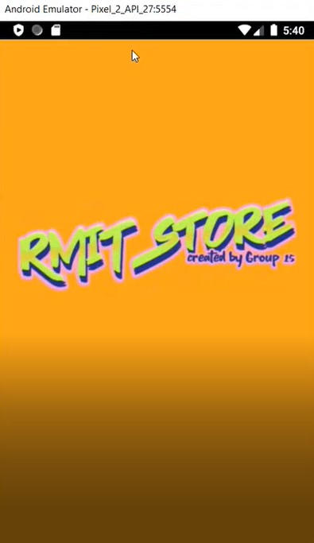

Course: COSC2657 - Android Development - Group 15
App Name: E-Commerce app - RMIT Store
Student Names & IDs
* Nguyen Tran Phu - s3811248
* Nguyen Quoc Minh - s3758994
* Le Ngoc Duy - s3757327
* Nguyen Dang Truong Long - s3757333   

## Work Distribution:
* Nguyen Quoc Minh - s3758994: main in charge of UI & help other teammates with their tasks.
* Le Ngoc Duy - s3757327: main in charge of UI and Search feature & help other teammates with their tasks.
* Nguyen Dang Truong Long - s3757333: main in charge of Cart and Order & help other teammates with their tasks.
* Nguyen Tran Phu - s3811248: main in charge of Authentication (signup/signin) and product Homepage & help other teammates with their tasks.	
--------------------------------------------
# Functionality of the App:
1. Login/Register/Logout:
- The user can continue to use the app even when not logged in
- The user can register an account to place order.
- When register, the user will be asked to verify their phone number via otp
- The user can register or login by tapping on the profile icon on the home page or by clicking on add to cart or 
  order now button in product detail while signed out
2. Homepage: Display popular product sorted by their rating, new product, all category, option to view all product, option to search all product, view user profile, view user cart
3. View all product with search by product name and filter by category
4. View detailed information about a product when click on the product card
5. User can place order of a product or add product to user's cart
6. Cart: User can add product to cart by quantity, view detailed cart information, remove items from cart
7. View user's profile and user's order history with order detail
8. Notification: User is notify when the price of the item in the user cart reduced
--------------------------------------------
# Technolgy used:
1. Firestore: to store the database of user information, products and categories of the shop.
2. Firebase Auth: to verify user phone number exist during register and to register/login user by email and password
3. Android Emulator: 1080x1920p 420dpi Pixel 2
4. Android Service: Run notification that notify the user when one of the item in their cart price is reduced
5. Android Broadcast-Receiver: Keep notification running when the user close their app 
6. Glide (https://github.com/bumptech/glide): Load image from an url
--------------------------------------------
# Special action requirement:
1. SHA-1: Add your SHA-1 to Firebase to use Register by OTP Feature.
--------------------------------------------
# Bugs:
1. UI is not designed perfectly due to the limited time.  
--------------------------------------------
# Reference:
1. StackOverflow

